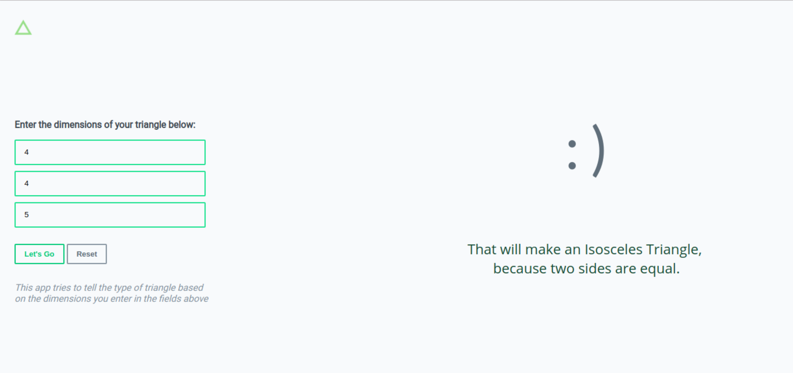
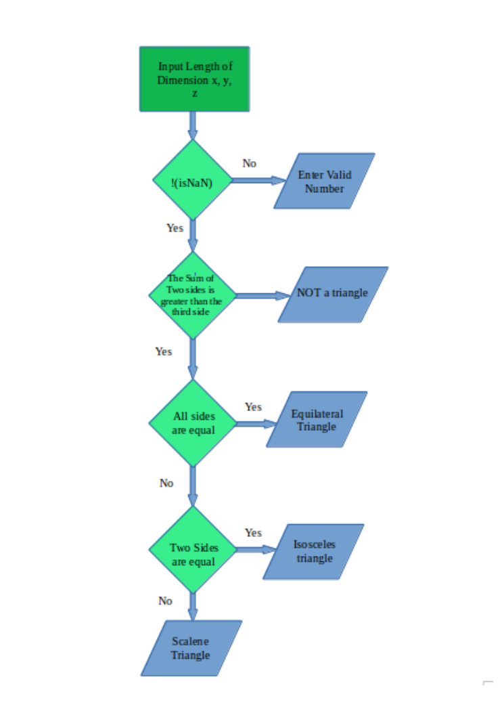

## Triangle Tracker

##### Authored by Michael Kipchumba

### About Project

Triangle Tracker is a web app that seeks to tell the type of triangle based on the length of the dimensions that a user enters. It tests for three types of triangles, equilateral, isosceles or scalene, based on length of its sides.

[Link to Live Site](https://mikechumba.github.io/triangles)

*The image of the homepage before the user enters and runs the data.*

*A result of the user's entry is displayed on the side.*

#### Project Approach

The aim of the project came down to the following:

- Take 3 values from the user and test them against set conditions then return the result.
- The values taken would have to be numerical and positive.
- The results should be displayed to the user.
- There would have option to reset the input fields to allow the user to enter new data, if they want to.

The web app manages to achieve most of this. Below is a flowchart that summarizes how the app works:

### Setting Things Up

If you want to use the project as your own, feel free to do so following the steps below:

- You can chose to fork this repository by clicking the fork button on the top of this page. Thereafter you can clone it from your own github page or;

- You can clone directly from my page using following these steps using your terminal: 
   
   - `cd <your-chosen-directory>`
   - `git clone https://github.com/mikechumba/triangles`
   - There you go. You can now edit the project on your own. Good Luck!

### Project Tools

##### Languages

- HTML5
- CSS3
- Javascript

###### Other

- Fonts (Roboto, Open Sans, Lato) from [Google Fonts](fonts.google.com).

### Debugging

The web app doesn't seem to have any bugs this far. If you happen to come across one, I will be happy to have a look at it. Contact Me on:

- [Facebook](https://web.facebook.com/ItsMikeChumba/)
- [Email](michaelchumba09@gmail.com)

### License 

MIT License

Copyright (c) 2018 Michael Kipchumba

Permission is hereby granted, free of charge, to any person obtaining a copy
of this software and associated documentation files (the "Software"), to deal
in the Software without restriction, including without limitation the rights
to use, copy, modify, merge, publish, distribute, sublicense, and/or sell
copies of the Software, and to permit persons to whom the Software is
furnished to do so, subject to the following conditions:

The above copyright notice and this permission notice shall be included in all
copies or substantial portions of the Software.

THE SOFTWARE IS PROVIDED "AS IS", WITHOUT WARRANTY OF ANY KIND, EXPRESS OR
IMPLIED, INCLUDING BUT NOT LIMITED TO THE WARRANTIES OF MERCHANTABILITY,
FITNESS FOR A PARTICULAR PURPOSE AND NONINFRINGEMENT. IN NO EVENT SHALL THE
AUTHORS OR COPYRIGHT HOLDERS BE LIABLE FOR ANY CLAIM, DAMAGES OR OTHER
LIABILITY, WHETHER IN AN ACTION OF CONTRACT, TORT OR OTHERWISE, ARISING FROM,
OUT OF OR IN CONNECTION WITH THE SOFTWARE OR THE USE OR OTHER DEALINGS IN THE
SOFTWARE.